# GLSL Gallery

A small gallery of fragment shaders created while studying  
[The Book of Shaders](https://thebookofshaders.com/).

Each shader includes:

- preview image
- original `.frag` source
- Shadertoy demo (when available)

---

## Live Gallery

You can browse the shaders visually here:

https://kackason.github.io/glsl_gallery/

---

## Shader Collection

<table>

<tr>

<td align="center">
<b>Caustics</b> 
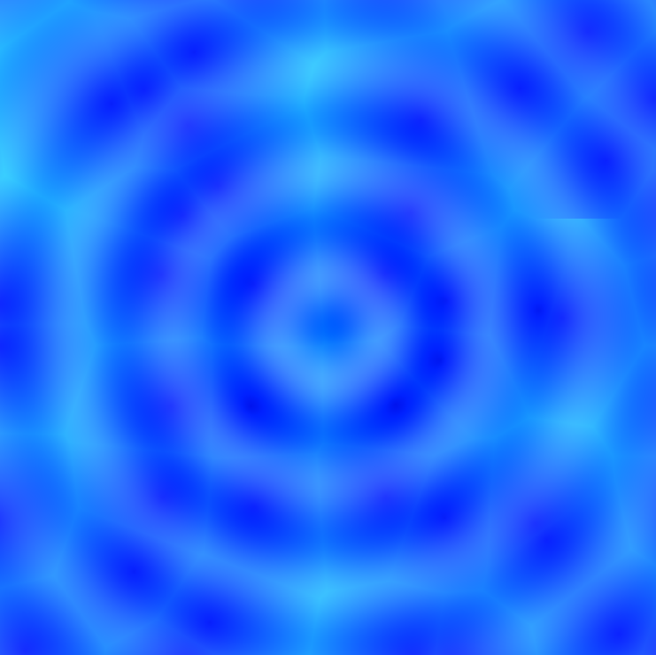 
<a href="shaders/caustics/shader.frag">source</a>
</td>

<td align="center">
<b>Cloth Like</b> 
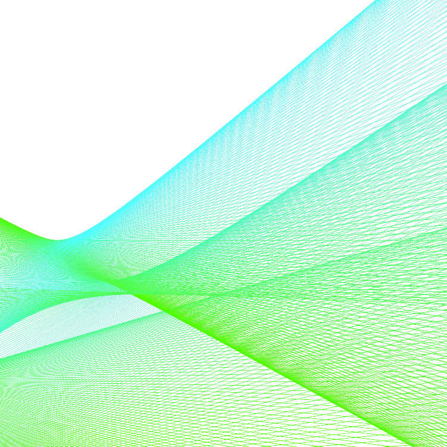 
<a href="shaders/cloth_like/shader.frag">source</a>
</td>

<td align="center">
<b>Designed Plate</b> 
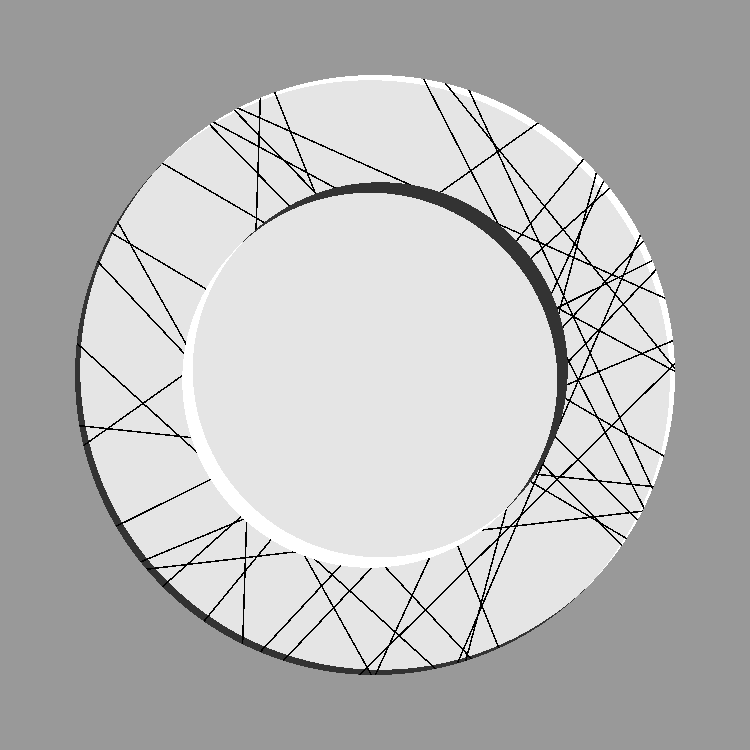 
<a href="shaders/designed_plate/shader.frag">source</a>
</td>

</tr>

<tr>

<td align="center">
<b>Diagonal Stripes Tile</b> 
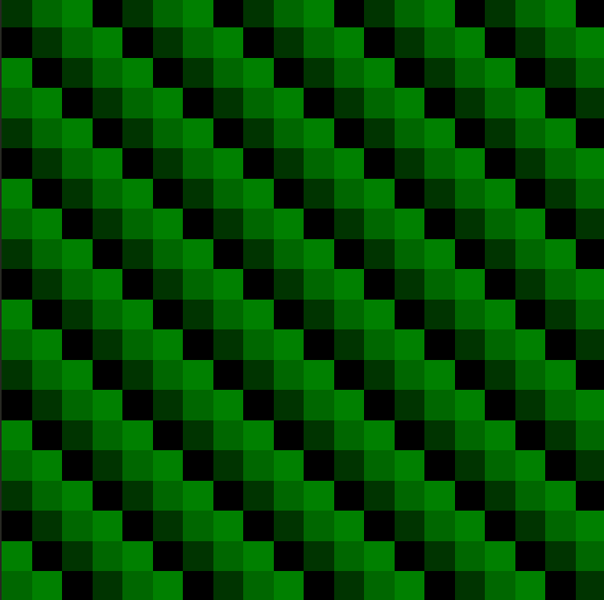 
<a href="shaders/diagonal_stripes_tile/shader.frag">source</a>
</td>

<td align="center">
<b>Diamond Dust</b> 
 
<a href="shaders/diamond_dast/shader.frag">source</a>
</td>

<td align="center">
<b>Envelope</b> 
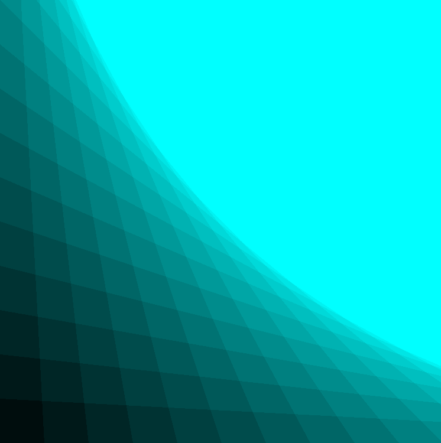 
<a href="shaders/envelope/shader.frag">source</a>
</td>

</tr>

<tr>

<td align="center">
<b>Firework</b> 
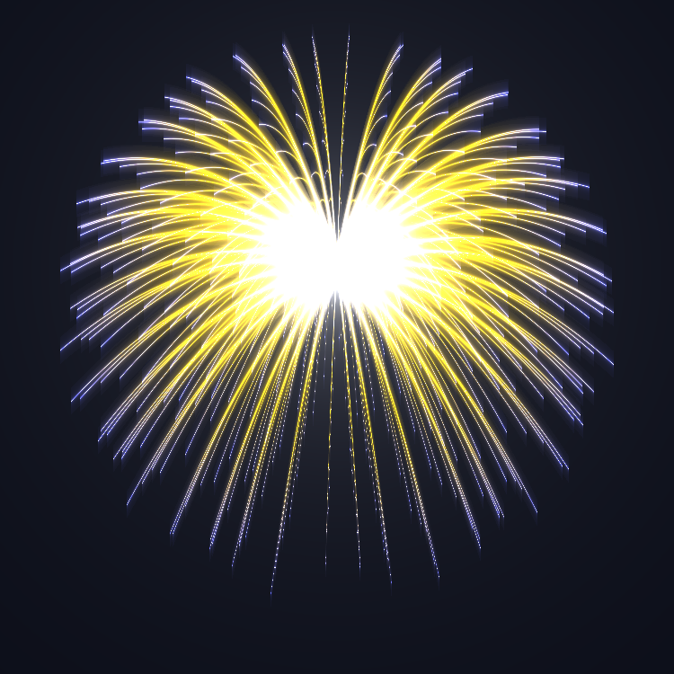 
<a href="shaders/firework/shader.frag">source</a>
</td>

<td align="center">
<b>Floating Tile</b> 
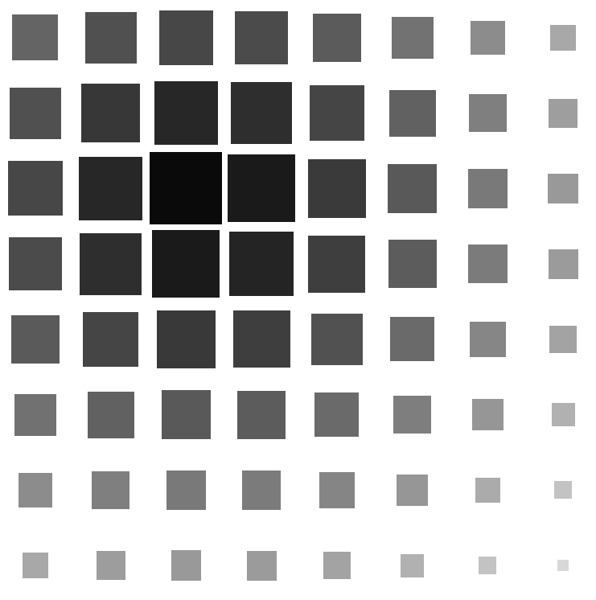 
<a href="shaders/floating_tile/shader.frag">source</a>
</td>

<td align="center">
<b>Gradation Tile</b> 
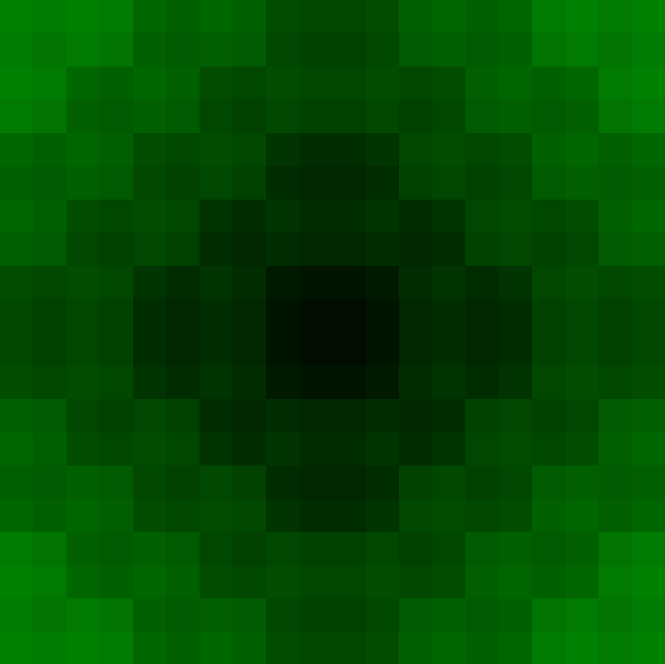 
<a href="shaders/gradation_tile/shader.frag">source</a>
</td>

</tr>

<tr>

<td align="center">
<b>Grid Rotation</b> 
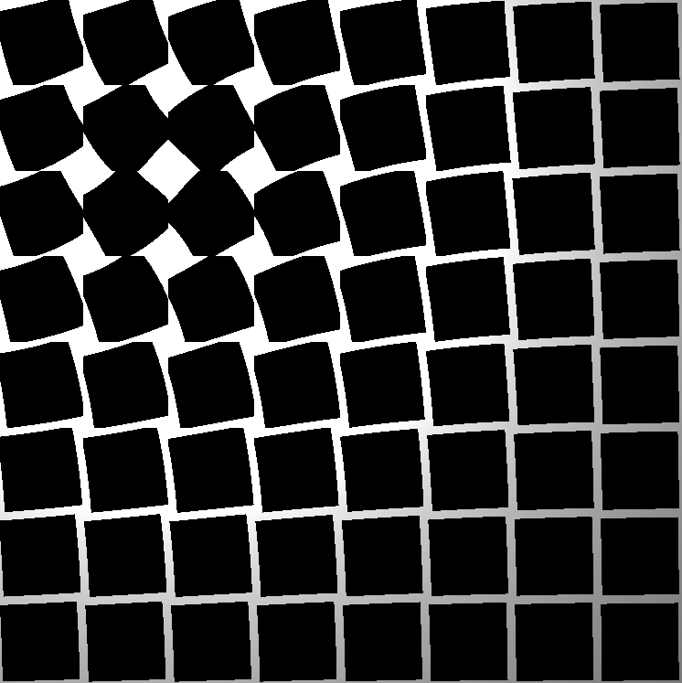 
<a href="shaders/grid_rotation/shader.frag">source</a>
</td>

<td align="center">
<b>Product XY</b> 
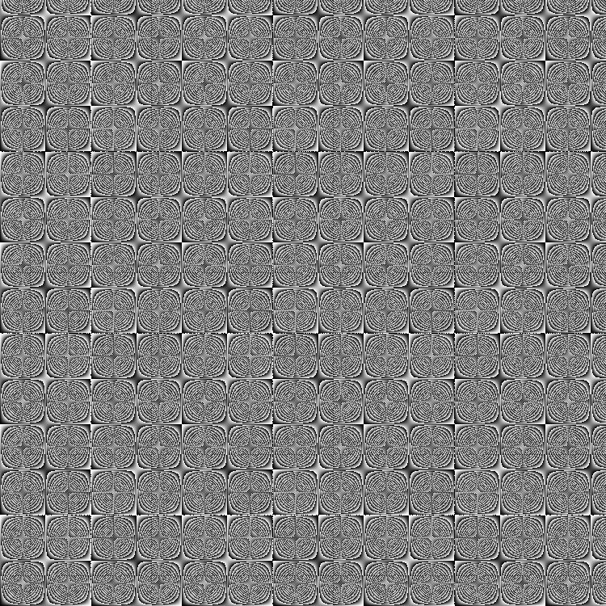 
<a href="shaders/product_xy/shader.frag">source</a>
</td>

<td align="center">
<b>RGB Diamond Cut</b> 
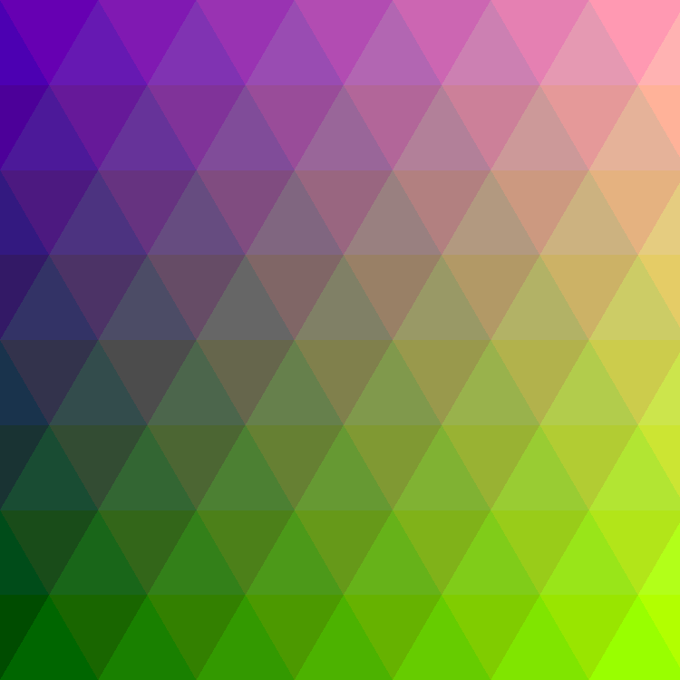 
<a href="shaders/rgb_diamond_cut/shader.frag">source</a>
</td>

</tr>

<tr>

<td align="center">
<b>Simple Wave</b> 
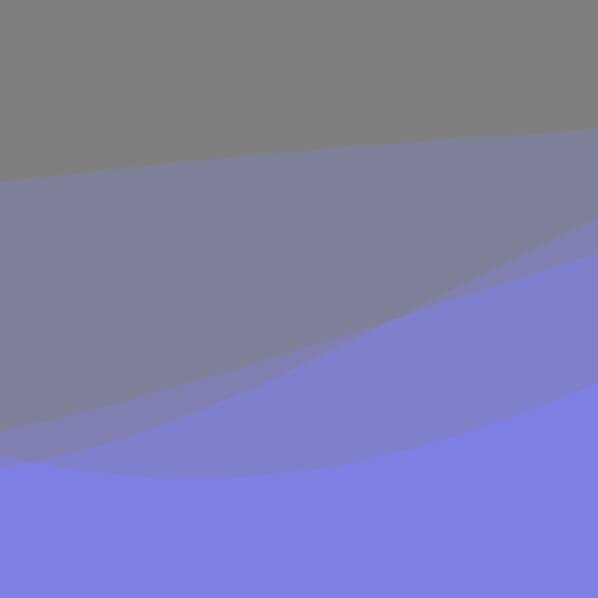 
<a href="shaders/simple_wave/shader.frag">source</a>
</td>

<td align="center">
<b>Watching Cube</b> 
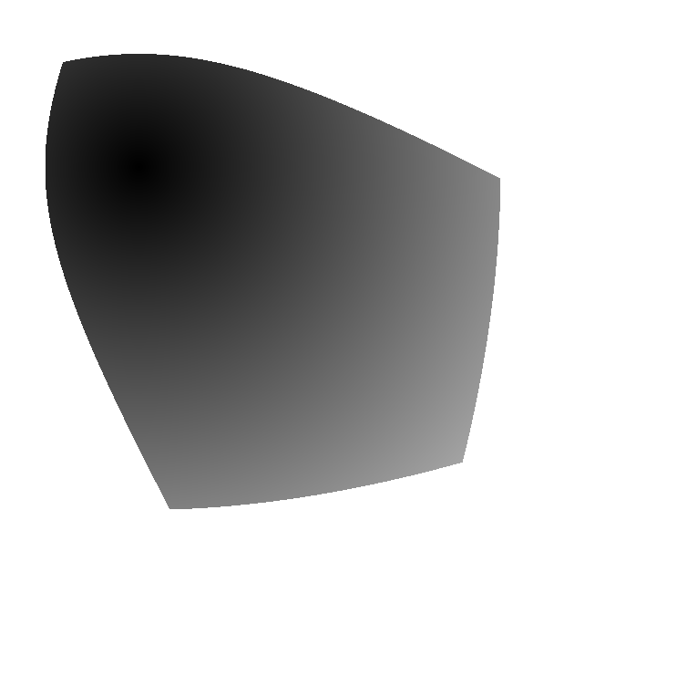 
<a href="shaders/watching_cube/shader.frag">source</a>
</td>

</tr>

</table>

---

## Structure
'''
glsl_gallery
│
├ index.html (gallery site)
├ shaders
│ ├ shader_name
│ │ ├ preview.png
│ │ ├ shader.frag
│ │ └ shader_shadertoy.frag
'''

---

## About

These shaders were created as experiments while learning GLSL and procedural graphics.

Most examples are inspired by concepts from:

- The Book of Shaders
- generative pattern design
- mathematical visualizations

---

## License

MIT